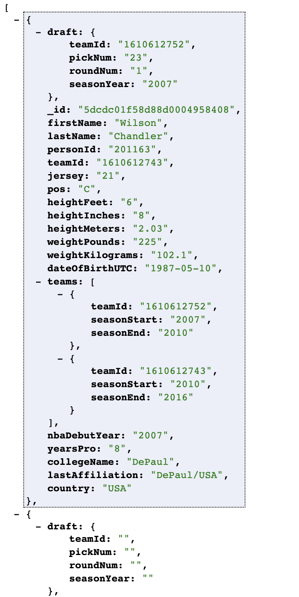
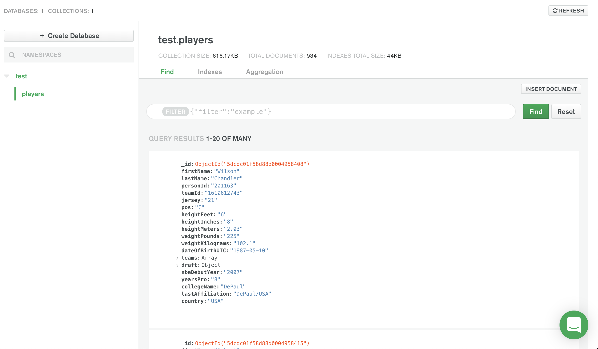

# NBA Players Full Stack Application (Backend)
#### By Mustafa Hassan

This project was developed using the MERN stack.

## Installation

To run this app locally:
- Clone this repository
- Change into the corresponding directory
- Run `npm install` to install dependencies used on this project
- Run `npm start` to launch the app in your browser

## Snapshot

## Technologies Used

- MERN
    - Mongoose
    - Express
    - React.JS
    - Node.JS
- Postman ( for testing backend CRUD functionality)
- Axios
- Bootstrap

## Contributing

To contribute to the source code, submit a pull request or issue to this repo!